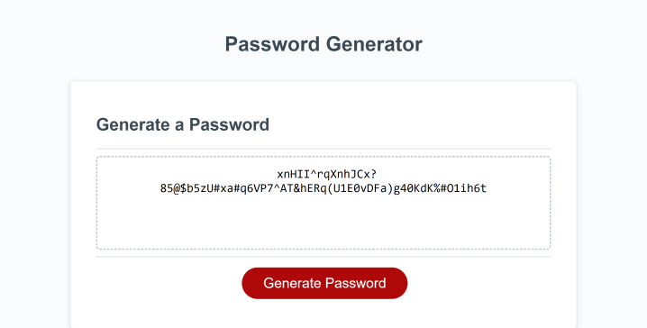
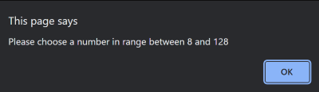
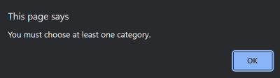

# Secure Password Generator

## Table of Contents

- [Description](#description)
- [Screenshot](#screenshot)
- [Usage](#usage)
- [Credits](#credits)
- [License](#license)
- [Access](#access)
- [How to Contribute](#how-to-contribute)
- [Tests](#tests)

## Description

Part of being on the modern internet means protecting your information. One of the ways you do this is to have a random password that is not easy to guess. This project was created as a secure password generator that allows the user to generate a truly random password for them. Several parameters are available to choose from to provide a degree customizeability for the user.

## Screenshot

## Usage

To use this app simply follow the prompts.

1. Click "Generate Password" shown in the screenshot above.

2. Choose the password length.

3. Choose whether or not you want to use lower case letters.

4. Choose whether or not you want to use upper case letters.

5. Choose whether or not you want to use numbers.

6. Choose whether or not you want to use special characters.

## Credits

Jon Bermudez: https://github.com/EvolanGIT

Edwin Pietrowski: https://github.com/BogartDME

### Document and Tutorial Links

https://blog.greenroots.info/5-ways-to-merge-arrays-in-javascript-and-their-differences

https://developer.mozilla.org/en-US/docs/Web/JavaScript/Reference/Global_Objects/isNaN

https://www.javascripttutorial.net/es-next/javascript-array-flat/

https://youtu.be/iKo9pDKKHnc

https://youtu.be/O-79Cb5s9U4

## Access

[Github Repository](https://github.com/difurung/Secure-Password-Generator)

[Deployed Application](https://difurung.github.io/Secure-Password-Generator/)

## License

Copyright <2022> <Denart Ifurung>

Permission is hereby granted, free of charge, to any person obtaining a copy of this software and associated documentation files (the "Software"), to deal in the Software without restriction, including without limitation the rights to use, copy, modify, merge, publish, distribute, sublicense, and/or sell copies of the Software, and to permit persons to whom the Software is furnished to do so, subject to the following conditions:

The above copyright notice and this permission notice shall be included in all copies or substantial portions of the Software.

THE SOFTWARE IS PROVIDED "AS IS", WITHOUT WARRANTY OF ANY KIND, EXPRESS OR IMPLIED, INCLUDING BUT NOT LIMITED TO THE WARRANTIES OF MERCHANTABILITY, FITNESS FOR A PARTICULAR PURPOSE AND NONINFRINGEMENT. IN NO EVENT SHALL THE AUTHORS OR COPYRIGHT HOLDERS BE LIABLE FOR ANY CLAIM, DAMAGES OR OTHER LIABILITY, WHETHER IN AN ACTION OF CONTRACT, TORT OR OTHERWISE, ARISING FROM, OUT OF OR IN CONNECTION WITH THE SOFTWARE OR THE USE OR OTHER DEALINGS IN THE SOFTWARE.

## How to Contribute

Pull requests are welcome. Any suggestions or changes may be made by opening up the comments.

## Tests

Test 1

Enter any charachter that is not a number. The user should be alerted that the input is not a number and directed to make a valid choice.

Test 2

Enter a number less than 8. The user should be alerted that the number is not within range.

Test 3

Enter a number greater than 128. The user should be alerted that the number is not within range.

Test 4

Choose "Cancel" on all four category choices. The user should be alerted that they must choose at least one category.

